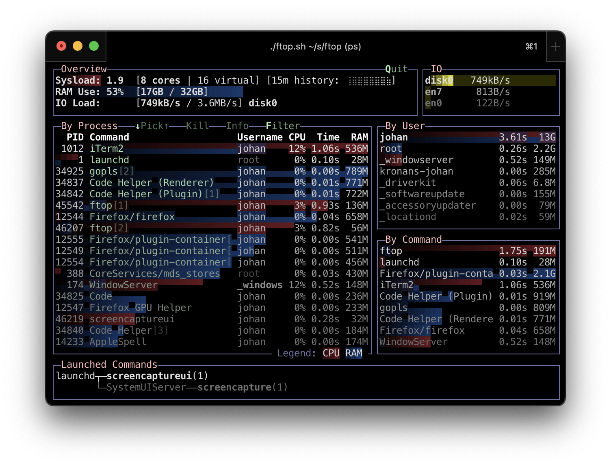

[](https://github.com/walles/ftop/actions/workflows/linux-ci.yml?query=branch%3Amain)

# `top` for Human Beings

See below for [how to install](#installation).

`ftop` is what I use when [LoadViz](https://github.com/walles/loadviz/) shows
something unexpected going on.

`ftop` is an evolution of [`ptop`](https://github.com/walles/ptop). `ftop`
provides the same helpful information but looks nicer.



Notes:

- CPU usage is shown as red bars, memory usage as blue bars.
- The Commands column is smart, showing `hello.py` rather than just `python`
  for `python hello.py`. [Smartness available for many different
  runtimes](https://github.com/walles/ftop/blob/main/internal/processes/commandline_test.go).
- Multiple processes sharing the same name are disambiguated with `[5]`
  suffixes. The `[1]` process is the oldest one. Suffixes are stable within one
  `ftop` run.
- Note the two sections on the right showing CPU and memory usage per user and
  per command.
- The process list can be filtered by a search string, matching command line,
  user name or PID.
- Note the `IO` section, showing IO usage per device with high watermarks.
- Sort keys are CPU usage, memory usage and the number of recently spawned child
  processes. CPU usage is defined as CPU-time-since-`ftop`-started, making the
  display mostly stable.
- Binaries launched during the current `ftop` run are listed at the bottom of
  the display.
- Note the core counts right next to the system load number, for easy
  comparison.
- Note the load history graph next to the load numbers. This is a visualization
  of the numbers you get from `uptime`.

## Installation

```
brew install walles/johan/ftop
```

Otherwise you can download binaries from
<https://github.com/walles/ftop/releases> and put them in somewhere in your
`$PATH`, `/usr/local/bin/` comes to mind.

Or do this to [install `ftop` into
`$GOPATH/bin`](https://manpages.debian.org/testing/golang-go/go-install.1.en.html),
make sure `$GOPATH/bin` is in your `$PATH`:

```sh
go install github.com/walles/ftop/cmd/ftop@latest
```

## Usage

Just type `ftop`, that's a good start!

To exit `ftop`, press `q`.

Also try `ftop --help` to see what else is available.

If you run into problems, try running with the `--debug` switch, that will get
you debug logs after `ftop` is done.

# Use Cases

- Why is my fan making noises?
  - Process top list
- I have a CPU meter that is peaking, why?
  - Process top list
- I have a RAM meter that is peaking, why?
  - Process top list
- Why is my computer slow?
  - Process top list
  - Process top list by IO usage
- `brew` is forking a lot of `curl` subprocesses, but not using much CPU. How
  can I find `brew` in this case?
  - Processes spawning many children during the last minute are moved up the
    list.
- Which processes are IO heavy?
  - Process top list by IO usage
- Is this specific process leaking memory?
  - When a process is picked, replace the user top lists with a braille
    history chart for the current process. This means we need to collect
    historical data for each process.
- Which new processes are being launched and why?
  - The ftop launched-binaries tree is excellent for this
- Is some particular service running?
  - Filter processes by name or number
- Which users are consuming CPU?
  - User top list by CPU usage
- Which users are consuming RAM?
  - User top list by RAM usage
- Which users are consuming IO?
  - User top list by IO usage
- I want to see the overall system load and resource usage
  - System load graph for CPU.
  - Memory pressure as measured by "system" CPU time. Or some number, since even
    if it doesn't help them, this is the number people expect to see.
  - Some IO load number.
- I need to check if my system is under heavy I/O load
  - Process top list by IO usage
  - Or if that's not possible, device top list by IO usage
- I want to see if a process is stuck or in an uninterruptible sleep state
  - Nah, let's just not care about this until somebody explicitly asks for it
- I need to find and kill a runaway process.
  - Find: Process top list
  - Kill: Pick process and provide a way for the user to request its termination
- Why is some process running on my system?
  - The px-for-one-process view is excellent for this

# Development

## Running

```
go run ./cmd/ftop
```

## Profiling

1. `go run ./cmd/ftop --profile`, this will generate profiling files
1. After `ftop` is done, analyze the generated profile files like this:
   - `go tool pprof -relative_percentages -web profile-cpu.out`
   - `go tool pprof -relative_percentages -web profile-heap.out`

## Screenshot

Scale your terminal to 90x30, `go run ./cmd/ftop` and screenshot that.

## Releasing a new Version

````
./release.sh
````

## TODO

- When hovering a process, show its hierarchy in the launched-binaries pane
- When hovering a process, show its start timestamp and its age in the
  launched-binaries pane
- Implement the process info screen. By spawning `px`? For starters I want to
  know:
  - full process command line (can take lots of space)
  - process hierarchy parents and possibly children, do what `px` does
  - process start time and age
- Implement the rest of the `px` process info features
- When hovering a process, show its nativity somewhere
- When process naming fails, it must be possible to access the full command
  line for error reporting. Consider it might be really long.
- When hovering a process, replace the two rightmost panes with info about that
  process, note that in the Output section above
- Offer to kill as root if we don't have permissions to kill a process. Prompt
  for `sudo` password.
- Test process rendering with process names with:
  - Wide chars, as in "multiple bytes per char"
  - Wide chars, as in "takes up multiple screen columns"
- Verify we have all Use Cases ^ covered
- Consider how to handle macOS in CI
- Profile and see if there's any low-hanging fruit to fix performance-wise
- Accept smaller window sizes
  - Drop columns if the terminal is really narrow
- Move macOS specific parsers into cross-platform parser files and add tests for
  them, just like we have for the Linux specific parsers.
- Should we remake `px`? `pf`?
- Should we remake `pxtree`? `pftree`?
- Make sure we are implementing the memory leak use case.

## TODO `iotop` replacement

- Record per process IO usage and present that in one or more columns.

## TODO misc

- Details: When no users were found to be logged in at process start,
  automatically detect whether it's because we don't have history that
  far back or whether it seems to be that nobody was actually logged in.
  Inform the user about the outcome.
- In the `pf` / `ftop` views, in the process owner column, maybe print other
  non-root process owners of parent processes inside parentheses?

## DONE

- Don't crash on too small terminal window
- Get the UI structure right with plain text only. Pressing ESC / q should exit.
- Drop the two rightmost panes if the terminal is too narrow
- Drop the launched-binaries tree if the terminal is too low
- Be happy enough with --version output
- Decide on the new name (`ftop`)
- Rename
- Ignore -E switch on Python command lines
- Check any mention of px, ptop or pxtree is intentional
- Update screenshot(s) ^
- Link back to the px repo for historical context
- Implement some crash reporting system, compare with `moor`
- Be happy enough with --help output, compare with `ptop --help`
- Set up CI building + testing on Linux
- Add CI status badge to the top of this README
- Document in this README how to make releases
- Verify all descriptions in this file + screenshots match the actual behaviors
  of our binaries.
- Make a release.
- Consider new sort orders for showing homebrew runs higher up the list. A third
  sort parameter is now "number of child processes launched during the last
  minute".
- If we have 10 different "claude" processes, dedup them as "claude[5]" in the
  Command column. The dedup suffixes should be stable within one `ftop` run.
- Implement filtering, note that in the Output section above
- Implement process picking with arrow keys, note that in the Output section
  above
- Implement killing the hovered process
- Consider having our own Homebrew tap
